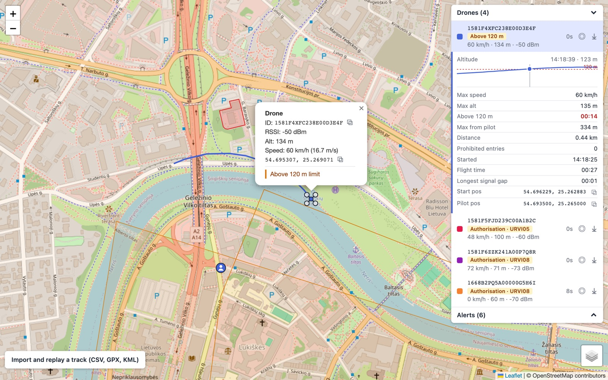
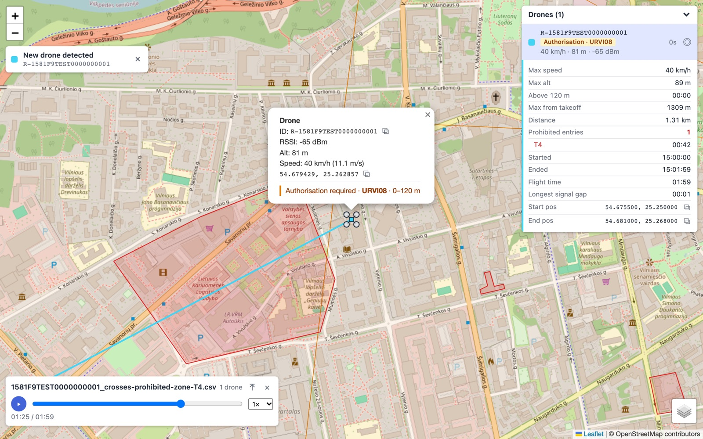

# GeoMap

Live map of object positions from Remote ID detections, built with Vue 3, TypeScript and Leaflet.

**Live demo:** [lipskij.github.io/geomap](https://lipskij.github.io/geomap/)

## Features

- Polls detections every second and moves existing markers in place (no redraw flicker)
- Object and pilot markers with flight paths (solid for objects, dashed for pilot). Where no data arrived for more than 5 s (a signal gap), the object path is drawn as a thin dotted link
- Distinct color per object
- Expandable object list: click to focus, follow mode, per-object track export (GPX, KML, CSV; CSV includes the pilot position)
- Flight stats per object: click an object in the list to show them under it
- Popup with ID, RSSI, altitude and speed; copyable ID and coordinates
- New object alerts, also kept in an alert log
- Track history and the alert log are saved in the browser and survive page reloads
- Fades objects after 10 s without updates, removes them after 60 s
- Map, satellite map layers
- Replay recorded tracks (CSV, GPX, KML) with play/pause, seek and speed control

## Flight stats

Click an object in the list to open its flight stats; click it again to close them.

| Stat | Meaning |
| --- | --- |
| Altitude chart | Altitude over time with the 120 m limit; hover for time and altitude |
| Max speed, Max alt | Highest recorded values |
| Above 120 m | Time spent above the altitude limit |
| Max from pilot | Farthest distance from the pilot. Shown as "Max from takeoff" when the track has no pilot position |
| Distance | Total distance flown |
| Prohibited entries | Number of entries into prohibited zones, with the time spent in each zone. Shows "–" when zone data isn't loaded |
| Started, Ended | Local time of the first and last recorded point (full date on hover) |
| Flight time | Time between the first and last point |
| Longest signal gap | Longest time between two recorded points |
| Start pos, End pos, Pilot pos | Coordinates, with a copy button |

For live objects, stats are calculated from the history recorded since the object was first seen. They update with every poll. Ended and End pos are not shown because the flight is still in progress.



For replayed tracks, stats cover the whole file.



## Alerts

Every message shown as a pop-up (new object, prohibited zone entry, above 120 m) is also added to the **Alerts** section at the bottom of the object list, newest first. Click an alert to focus its object; alerts of objects no longer on the map are greyed out. The log can be exported as CSV or cleared. It keeps the last 500 alerts and is saved in the browser (`localStorage`).

## Saved history

Live track history is saved in the browser (IndexedDB) every 5 s, so exports and flight stats keep the full flight after a reload. Paths of objects still in the air are redrawn on the map. Tracks without updates for 24 hours are removed when the app starts. The history is stored per browser and is not shared between devices.

## Requirements

Node.js 20.19+ or 22.12+

## Run

```bash
npm install
npm run dev
```

## Data format

`GET /api/...` returns an object keyed by `basic_id`:

```json
{
  "1581F5FJD239C00A1B2C": {
    "basic_id": "1581F5FJD239C00A1B2C",
    "rssi": -62,
    "drone_lat": 54.6875,
    "drone_long": 25.2864,
    "drone_altitude": 84,
    "drone_speed": 13.4,
    "pilot_lat": 54.6872,
    "pilot_long": 25.2797,
    "last_update": 1790000000
  }
}
```

| Field            | Unit               |
| ---------------- | ------------------ |
| `drone_altitude` | m                  |
| `drone_speed`    | m/s, horizontal    |
| `last_update`    | Unix time, seconds |

## Real data

Mock data is on by default. To read from a real `/api/detections` on the same origin:

```bash
VITE_USE_MOCK=false npm run build
```

## Drone zones (local only)

When running `npm run dev`, the app loads Lithuanian UAS geographical zones from the ANS UTM map (`utm.ans.lt`) through the Vite dev server and:

- draws them as a "Drone zones" layer (red: prohibited, amber: authorisation required, grey: information)
- checks each object: inside a zone horizontally and between the zone's lower and upper limit
- flags objects above 120 m
- alerts when an object enters a prohibited zone or goes above 120 m
- counts prohibited zone entries in the flight stats

Only zones active at the current time are used; zones reload every 5 minutes. Altitude is treated as height above ground, since all zone limits are AGL.

Zones are not loaded in production builds (GitHub Pages).

## Project structure

```
src/
  api.ts                          # fetchDetections(): mock or real API
  types.ts                        # Detection types
  config.ts                       # polling, fade and removal timings
  colors.ts                       # per-object colors
  export.ts                       # GPX / KML / CSV export
  mock/detections.ts              # simulated objects
  composables/useDetections.ts    # 1 s polling
  composables/useTrackHistory.ts  # track history (saved in IndexedDB) for export and live flight stats
  composables/useZones.ts         # zone loading and refresh
  composables/useToasts.ts        # new object and zone alerts, alert log
  composables/useReplay.ts        # replay playback, flight stats calculation
  replay/parse.ts                 # CSV / GPX / KML track parsing
  geo.ts                          # point-in-polygon helpers
  zones.ts                        # zone parsing, active times, zone/altitude check
  components/MapView.vue          # Leaflet map, markers, paths
  components/DroneList.vue        # object list
  components/FlightStats.vue      # flight stats under a list item
  components/ToastStack.vue       # alert messages
  components/ReplayPanel.vue      # replay controls
  App.vue
```

## Deploy

Pushing to `main` deploys to GitHub Pages via `.github/workflows/deploy.yml`.
