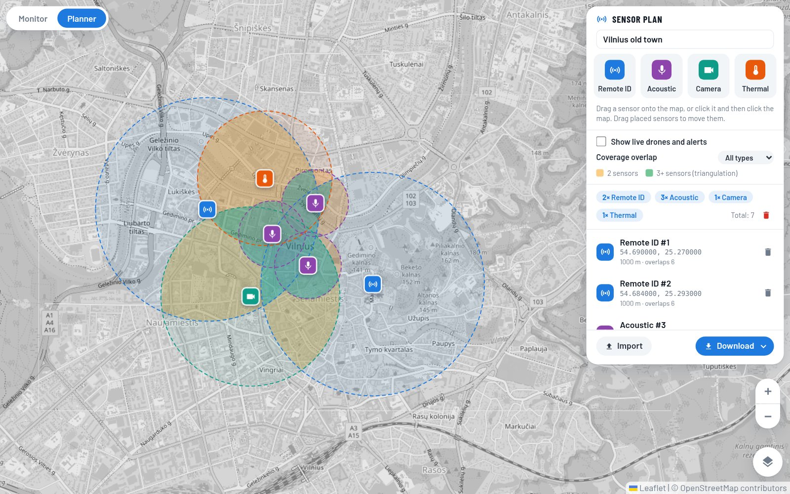

# GeoMap

Live map of object positions from Remote ID detections, built with Vue 3, TypeScript and Leaflet.

**Live demo:** [lipskij.github.io/geomap](https://lipskij.github.io/geomap/)

## Features

- Polls detections every second and moves existing markers in place (no redraw flicker)
- Object and pilot markers with flight paths (solid for objects, dashed for pilot). Where no data arrived for more than 5 s (a signal gap), the object path is drawn as a thin dotted link
- Distinct color per object
- Expandable object list: click to focus, follow mode, per-object track export (GPX, KML, CSV; CSV includes the pilot position)
- Flight stats per object: click an object in the list to show them under it
- Popup with ID, RSSI, altitude and speed; copyable ID and coordinates
- New object alerts, also kept in an alert log
- Track history and the alert log are saved in the browser and survive page reloads
- Fades objects after 10 s without updates, removes them after 60 s
- Light (default), dark, full-colour and satellite base maps; panels switch to dark colours on the dark map
- Sensor planner: place Remote ID, acoustic and camera sensors on the map, see where their coverage overlaps, and export a deployment list (see [Sensor planner](#sensor-planner))
- English and Lithuanian interface; switch the language in the layers panel (round button, bottom right). The choice is remembered; the default follows the browser language
- Replay recorded tracks (CSV, GPX, KML) with play/pause, seek and speed control

## Flight stats

Click an object in the list to open its flight stats; click it again to close them.

| Stat                          | Meaning                                                                                                          |
| ----------------------------- | ---------------------------------------------------------------------------------------------------------------- |
| Altitude chart                | Altitude over time with the 120 m limit; hover for time and altitude                                             |
| Max speed, Max alt            | Highest recorded values                                                                                          |
| Above 120 m                   | Time spent above the altitude limit                                                                              |
| Max from pilot                | Farthest distance from the pilot. Shown as "Max from takeoff" when the track has no pilot position               |
| Distance                      | Total distance flown                                                                                             |
| Prohibited entries            | Number of entries into prohibited zones, with the time spent in each zone. Shows "–" when zone data isn't loaded |
| Started, Ended                | Local time of the first and last recorded point (full date on hover)                                             |
| Flight time                   | Time between the first and last point                                                                            |
| Longest signal gap            | Longest time between two recorded points                                                                         |
| Start pos, End pos, Pilot pos | Coordinates, with a copy button                                                                                  |

For live objects, stats are calculated from the history recorded since the object was first seen. They update with every poll. Ended and End pos are not shown because the flight is still in progress.


For replayed tracks, stats cover the whole file.


## Alerts

Every message shown as a pop-up (new object, prohibited zone entry, above 120 m) is also added to the **Alerts** section at the bottom of the object list, newest first. Click an alert to focus its object; alerts of objects no longer on the map are greyed out. The log can be exported as CSV or cleared. It keeps the last 500 alerts and is saved in the browser (`localStorage`).

## Sensor planner

Switch to **Planner** (top left) to plan where sensors should go. Live drones, alerts and the replay panel are hidden while planning; **Show live drones and alerts** brings them back. Planned sensors are only shown in Planner mode.

- Drag a sensor type (Remote ID, acoustic, camera) onto the map, or click it and then click the map. Drag placed sensors to move them
- Each sensor has a coverage circle with a default radius per type: Remote ID 1000 m, acoustic 300 m and camera 800 m (per-sensor values will come with the real sensor list)
- **Coverage overlap** shades where 2 sensors (amber) or 3+ sensors (green, enough to triangulate) cover the same spot, for all types or one type. Each sensor in the list shows how many others it overlaps
- Coverage follows the terrain: a spot counts as covered only if a drone 30 m above the ground there is in line of sight of the sensor (higher drones are seen at least as well). Each sensor's mount height above the ground (mast, roof) is set in the list, 3 m by default. Earth curvature is included. Acoustic sensors ignore terrain, since sound bends around hills. Spots in range that hills hide from every sensor are shaded grey. Elevation comes from [Terrarium tiles](https://registry.opendata.aws/terrain-tiles/) (EU-DEM for Lithuania, about 25 m resolution, bare ground: forests and buildings aren't counted). The terrain itself isn't drawn. Check the line-of-sight logic with `node scripts/coverage-check.ts`
- The list counts sensors per type: the deployment list for the field team
- **Download** offers CSV (deployment list: `id,type,lat,lng,range_m,mast_m`) or JSON (plan file with its name). **Import** reads either; unknown types and invalid positions are skipped
- The plan is saved in the browser (`localStorage`). Build with `VITE_PLANS_BACKEND=true` to load and save it via `GET`/`PUT /api/plans/current` on the backend; a local copy is always kept, and a failed save shows an error instead of losing the plan



## Requirements

Node.js 20.19+ or 22.12+

## Run

```bash
npm install
npm run dev
```

## Data format

`GET /api/detections` returns one decoded Remote ID frame, or an array of them (ESP32 `id_open` JSON). `src/api.ts` maps each one to the app's `Detection`, keyed by `uav id`:

```json
{
  "uav id": "112624150A90E3AE1EC0",
  "rssi": -62,
  "uav latitude": 51.4791,
  "uav longitude": -0.0013,
  "uav altitude": 110,
  "uav speed": 0,
  "base latitude": 51.479,
  "base longitude": -0.001,
  "unix time": 1574357589,
  "received": 1790000000
}
```

| Field                              | Maps to                    | Unit               |
| ---------------------------------- | -------------------------- | ------------------ |
| `uav id`                           | `basic_id`                 |                    |
| `uav latitude` / `uav longitude`   | `drone_lat` / `drone_long` | degrees            |
| `uav altitude`                     | `drone_altitude`           | m                  |
| `uav speed`                        | `drone_speed`              | m/s, horizontal    |
| `base latitude` / `base longitude` | `pilot_lat` / `pilot_long` | degrees            |
| `received`                         | `last_update`              | Unix time, seconds |

Other fields (`unix time`, `mac`, `operator`, `self id`, `uav heading`, `seconds`, auth pages) are ignored for now.

## Real data

Mock data is on by default. Settings (environment variables at build / dev time):

| Variable        | Meaning                                                             |
| --------------- | ------------------------------------------------------------------- |
| `VITE_USE_MOCK` | `false` reads the real API                                          |
| `VITE_API_URL`  | backend origin, e.g. `https://api.example.com`; empty = same origin |
| `API_TARGET`    | dev only: Vite forwards `/api/*` to this backend                    |

```bash
# local dev against a backend on port 8000
VITE_USE_MOCK=false API_TARGET=http://localhost:8000 npm run dev

# build for a backend on another domain (it must allow CORS from the app's origin)
VITE_USE_MOCK=false VITE_API_URL=https://api.example.com npm run build
```

GitHub Pages builds read `VITE_USE_MOCK` and `VITE_API_URL` from the repository variables (Settings → Secrets and variables → Actions → Variables). Without them the deployed site keeps using mock data.

Each response must list every drone currently seen (latest frame per drone): a drone missing from a response is dropped from the map. `received` (Unix seconds, set by the backend when the frame arrived) is used as the drone's last-seen time; the drone's own `unix time` is ignored because drone clocks are often wrong. Until the backend sends `received`, the browser's time is used.

## Drone zones (local only)

When running `npm run dev`, the app loads Lithuanian UAS geographical zones from the ANS UTM map (`utm.ans.lt`) through the Vite dev server and:

- draws them as a "Drone zones" layer, off by default, switched on in the layers panel (red: prohibited, amber: authorisation required, grey: information)
- checks each object: inside a zone horizontally and between the zone's lower and upper limit
- flags objects above 120 m
- alerts when an object enters a prohibited zone or goes above 120 m
- counts prohibited zone entries in the flight stats

Only zones active at the current time are used; zones reload every 5 minutes. Altitude is treated as height above ground, since all zone limits are AGL.

Zones are not loaded in production builds (GitHub Pages).

## Project structure

```
src/
  api.ts                          # fetchDetections(): mock or real API
  types.ts                        # Detection types
  i18n.ts                         # English / Lithuanian texts, language switch
  config.ts                       # polling, fade and removal timings
  colors.ts                       # per-object colors
  icons.ts                        # SVG icons used across the UI
  export.ts                       # GPX / KML / CSV export
  mock/detections.ts              # simulated objects
  composables/useDetections.ts    # 1 s polling
  composables/useTrackHistory.ts  # track history (saved in IndexedDB) for export and live flight stats
  composables/useZones.ts         # zone loading and refresh
  composables/useSensors.ts       # current sensor plan, sensor types and default ranges
  plans.ts                        # plan storage (browser / backend), plan file format and validation
  coverage.ts                     # overlap shading of sensor coverage
  composables/useToasts.ts        # new object and zone alerts, alert log
  composables/useReplay.ts        # replay playback, flight stats calculation
  replay/parse.ts                 # CSV / GPX / KML track parsing
  geo.ts                          # point-in-polygon helpers
  zones.ts                        # zone parsing, active times, zone/altitude check
  components/MapView.vue          # Leaflet map, markers, paths
  components/DroneList.vue        # object list
  components/FlightStats.vue      # flight stats under a list item
  components/ToastStack.vue       # alert messages
  components/ReplayPanel.vue      # replay controls
  components/LayersPanel.vue      # base map, zones layer and language picker
  components/PlannerPanel.vue     # sensor planner: palette, placed sensors, CSV export
  components/Icon.vue             # renders an icon from icons.ts
  App.vue
```

## Deploy

Pushing to `main` deploys to GitHub Pages via `.github/workflows/deploy.yml`.
